```mermaid
graph TD
    A[AIStrategyEngine] --> B(AITrendAnalyzer)
    A --> C(holo_misha_instance)
    A --> D(SecurityLoggingService)

    E[AutoScalingEngine] --> F(FabAnalytics)
    E --> C
    E --> D

    G[ChipFlowOrchestrator] --> H(QuestMaster)
    G -.-> C
    G -.-> D

    I[TaskFusionEngine] --> J(AgentCoreTrainer)
    I --> K(ChipFlowOrchestratorImpl)
    I --> L(QuantumSingularityFirewall)
    I --> M(AgentGuard)
    I --> N(PredictiveScalingEngine)
    I --> O(ZeroDefectEngine)
    I --> P(FamilyCollaborationEngine)
    I --> Q(AIDesignAutomation)
    I --> D
    I --> R(holo_misha_instance)
```

# 🧠 Зв'язки між агентами системи HoloMisha

Цей документ містить візуалізацію зв'язків між ключовими агентами системи. Він допомагає розуміти архітектуру та виявляти можливі точки оптимізації.

---

## 📊 Діаграма зв'язків

---

## 🧩 Пояснення

- **Центральний агент:** [TaskFusionEngine](file:///e:/globalscope-multiframe/src/ai/taskfusion_engine.py#L55-L84) – координує роботу більшості інших.
- **AR-інтеграція:** [holo_misha_instance](file:///e:/globalscope-multiframe/src/webxr/holomisha_ar.py#L195-L195) використовується для сповіщень, але може бути точкою збою.
- **Безпека:** [SecurityLoggingService](file:///e:/globalscope-multiframe/src/security/security_logging_service.py#L13-L54) та [QuantumSingularityFirewall](file:///e:/globalscope-multiframe/src/security/quantum_singularity_firewall.py#L15-L78) забезпечують безперервний захист.

---

## 🛠️ Рекомендації

1. Зменшити залежність від [holo_misha_instance](file:///e:/globalscope-multiframe/src/webxr/holomisha_ar.py#L195-L195) шляхом використання подій (event-driven architecture).
2. Виділити спільні інтерфейси для агентів, щоб зробити систему більш модульною.
3. Додати автоматичне тестування зв’язків між агентами.

---